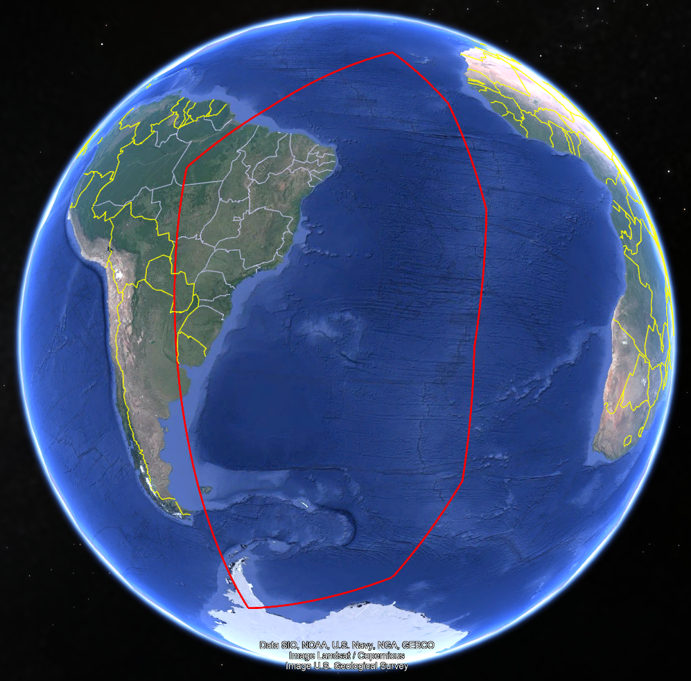

# Curva de Alineación

La curva de alineación representa, en forma ideal, la trayectoria del eje de colimación de un teodolito. A diferencia de las secciones normales y centrales, la curva de alineación no es plana sino que tiene torsión, lo que impide soluciones analíticas directas para los problemas geodésicos directo e inverso. Este programa es una traducción en Rust de "curvas.py" donde se implementan las fórmulas de la curva a partir de su función implícita y sus derivadas, formulando sistemas de ecuaciones diferenciales ordinarias para el cálculo de acimut, longitud y área. Las fórmulas están descritas en el documento ["La curva de alineación"](https://doi.org/10.13140/RG.2.2.20608.39684).
El problema inverso se resuelve eficientemente mediante integración numérica con el método de Dormand-Prince. El problema directo requiere un esquema iterativo de Newton-Raphson bivariado con derivadas numéricas, resultando computacionalmente costoso; además no es una implementación robusta y debe ser siempre comprobado con el problema inverso.
Esta forma de resolver la curva de alineación se extiende a los casos de la sección normal primera y la sección central. Estas curvas suelen ser similares entre sí, excepto cuando los puntos terminales están cerca de ser antipodales. En este ejemplo se representan las curvas de alineación (verde), sección normal (magenta) y sección central (negro) con puntos terminales (latitud, longitud): (-30, 0) y (30, 179).


## Tabla de Contenidos

- [Requisitos](#Rrequisitos)
- [Instalación](#Instalación)
- [Uso](#Uso)
- [Ejemplos](#Ejemplos)
- [Licencia](#Licencia)

## Requisitos

- **rust+cargo**

```bash
rustup default nightly
```
## Instalación

**Clonar el repositorio:**

```bash
git clone https://github.com/geon6-sebastian/curvaalineacion-rs.git
cd curvaalineacion-rs
cargo build --release
cd target/release
```

---

## Uso

Para ejecutar el script, utiliza el siguiente comando en la terminal:

```bash
curvas [argumentos]
```

En Linux:
```bash
./curvas [argumentos]
```

### Argumentos

| Argumento                                 | Descripción                                                                                                          | Requerido        | Default                    |
| ----------------------------------------- | -------------------------------------------------------------------------------------------------------------------- | ---------------- | -------------------------- |
| -i, --inverso                             | Ejecutar problema inverso                                                                                            | No               | -                          |
| -d, --directo                             | Ejecutar problema directo                                                                                            | No               | -                          |
| -poly, --poly-sup ('coords.csv')          | Calcula la superficie dentro de un polígono dado en un archivo CSV/TXT                                               | No               | -                          |
| -t, --tipo ['align', 'normal', 'central'] |                                                                                                                      | No               | 'central'                  |
| -P1 (latitud longitud)                    | Punto 1: latitud longitud (en grados decimales). Requerido para -i y -d                                              | Si, para -i y -d | -                          |
| -P2 (latitud longitud)                    | Punto 1: latitud longitud (en grados decimales). Requerido para -i                                                   | Si, para -i      | -                          |
| -e (a, inv_f)                             | Elipsoide: semieje_mayor inversa_aplastamiento (por defecto: GRS80)                                                  |                  | GRS80_a, 298.2572221008827 |
| -o, --output ('nombrearchivo')            | Nombre base para guardar salidas (KMZ, SHP, CSV). Este comando SOBREESCRIBE los archivos existentes del mismo nombre | No               | -                          |
| -az (acimut)                              | Acimut inicial (en grados decimales). Requerido para -d                                                              | Si, para -d      | -                          |
| -s (distancia)                            | Distancia (en metros). Requerido para -d                                                                             | Si, para -d      | -                          |
| -mstep, --max-step (paso)                 | Paso máximo de h para Dormand-Prince en grados decimales                                                             | No               | 0.1                        |

---

## Ejemplos

**Ejemplo con puntos cercanos a ser antipodales (Problema inverso, paso 0.1 grados):**

```bash
curvas -i -P1 -30 0 -P2 30 179 -t align -o curva_align
```

Salida:

```bash
========================================
Acimut (deg): 110.7675169475
Distancia (m): 21656598.9243
Area (m2): 1
Latitud Vértice phi0 (deg): 38.5170077016
Longitud Vértice L0 (deg): 135.6005780565
========================================

Archivos guardados con base: curva_align

Generando archivos: curva_align.* ...
Shapefile guardado como 'curva_align_puntos.shp' con 2389 puntos y 5 columnas de datos.
Archivos generados
```

Estos comandos generan las curvas de la figura más arriba.

```bash
curvas -i -P1 -30 0 -P2 30 179 -t normal -o curva_normal
```

```bash
curvas -i -P1 -30 0 -P2 30 179 -t central -o curva_central
```


**Ejemplo básico de problema directo, paso 0.01 grados:**

```bash
curvas -d -P1 -30 -60 -a 30 -s 5000000 -t align -o align_0.01 -mstep 0.01
```

Para distancias muy largas, el algoritmo es altamente inestable cuando el paso máximo es menor a 0.01.

**Cálculo de la superficie de un polígono uniendo vértices con la curva de alineación:**

```bash
curvas -poly poligono.csv -t align -o poligo
```

Donde el contenido de "poligono.csv" es:
```csv
"Y","X"
-73.3370959549,-70.0386475104
-64.4263843966,-8.3982535173
-46.8962976052,-5.0393662652
-29.483791878,-11.5368935014
-10.7399870261,-13.5643624094
6.1376257255,-20.0001368275
16.5713806345,-28.3861075176
2.0613835089,-45.1506945789
-6.5624498119,-56.1496555295
```
---

La salida del comando es:
```bash
========================================
Calculando polígono con 9 vértices...
Arista 1 -> 2: Distancia = 2527150.9066 m, Acimut = 99.31718166 deg, Área = -41312008676305.24 m²
Arista 2 -> 3: Distancia = 1962417.5168 m, Acimut = 7.61017844 deg, Área = -1985599917508.05 m²
Arista 3 -> 4: Distancia = 2013087.0434 m, Acimut = -18.51916513 deg, Área = 2873389143572.14 m²
Arista 4 -> 5: Distancia = 2085855.2856 m, Acimut = -6.21369770 deg, Área = 498719358475.52 m²
Arista 5 -> 6: Distancia = 1998041.0725 m, Acimut = -21.20642523 deg, Área = 184464428610.65 m²
Arista 6 -> 7: Distancia = 1472208.4403 m, Acimut = -37.67719168 deg, Área = -1171528707698.50 m²
Arista 7 -> 8: Distancia = 2438801.7893 m, Acimut = -129.40724881 deg, Área = -1943518269245.79 m²
Arista 8 -> 9: Distancia = 1550287.6557 m, Acimut = -128.03738171 deg, Área = 306439414761.83 m²
Arista 9 -> 1: Distancia = 7473628.1239 m, Acimut = -175.69485245 deg, Área = 7574200475568.19 m²
----------------------------------------
Superficie del polígono (m2): 34975442749769.24
========================================

Archivos guardados con base: poligo
```



En Meyer, T. H. (2024, p. 140) [Vector-algebra algorithms... ](https://www.mdpi.com/2673-7418/4/2/8) se proporciona el ejemplo
P1 (-40, 165) P2 (45, 0) reportando una distancia de 18671843.56 m. Pero, en nuestro caso al ejecutar
```bash
curvas -i -P1 -40 165 -P2 45 0 -t align
```
se tiene una inconsistencia de unos 3 m:
```bash
========================================
Acimut (deg): -62.3889781191
Distancia (m): 18671840.3838
Area (m2): -34934108256376
Latitud Vértice phi0 (deg): 48.6480754482
Longitud Vértice L0 (deg): 28.2981412449
========================================
```
En el paper [Vector-algebra algorithms... ](https://www.mdpi.com/2673-7418/4/2/8), Meyer escribe "...the arc length of the curve of alignment was computed by recursively bisecting the curve into linear segments and summing the lengths of the segments until the length converged to submillimeter levels.", pero no tengo forma de reproducir el método de cálculo.
## Licencia

Este proyecto está bajo la Licencia MIT.

---
